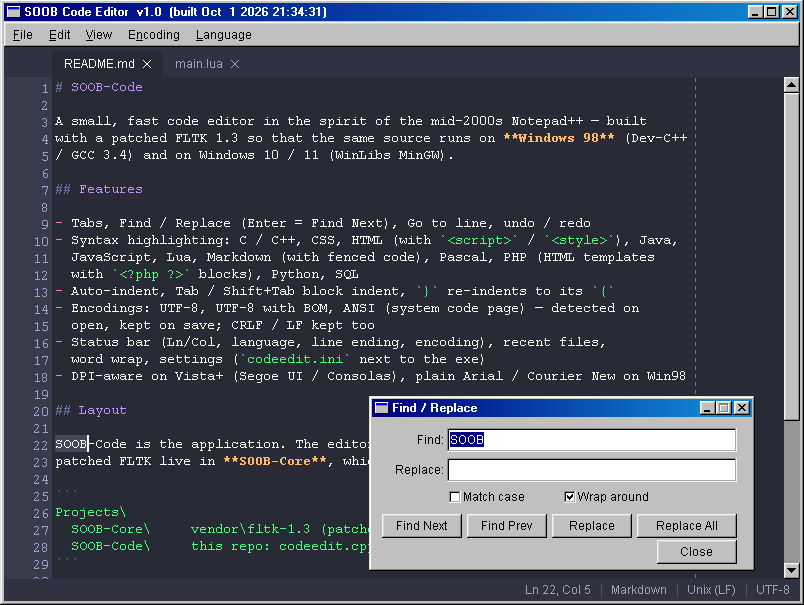

# SOOB-Code

A small, fast code editor in the spirit of the mid-2000s Notepad++ — built
with a patched FLTK 1.3 so that the same source runs on **Windows 98** (Dev-C++
/ GCC 3.4) and on Windows 10 / 11 (WinLibs MinGW).



*Version 1.0 on Windows 98: Markdown highlighting, tabs, Find / Replace and
the status bar.*

## Features

- Tabs, Find / Replace (Enter = Find Next), Go to line, undo / redo
- Syntax highlighting: Bash / sh, Batch (`.bat` / `.cmd`), C / C++ (also
  `.glsl` / `.vert` / `.frag` / `.inl` / `.rc`), CSS, HTML (with `<script>` /
  `<style>`), INI (`.ini` / `.cfg` / `.inf`), Java, JavaScript (also `.ts` /
  `.tsx`), JSON (keys told apart from string values), Lua, Markdown (with
  fenced code), Pascal, PHP (HTML templates with `<?php ?>` blocks), Python,
  SQL, XML (`.xml` / `.xsd` / `.xsl` / `.svg` / `.tmx` / `.qrc` / `.csproj`)
- Auto-indent, Tab / Shift+Tab block indent; `}` `]` `)` re-indent to their
  opener, and so do Lua's `end` / `until` / `else` and Pascal's
  `end` / `until` / `except` / `finally`
- Trailing whitespace stripped on save (optional, on by default; Markdown
  keeps a two-space hard line break)
- Smart Home, centre-on-find, re-indent on paste
- Right-click menu (Cut / Copy / Paste / Delete); Tools / Format JSON
  (Alt+J) pretty-prints the selection or the whole file with the Tab
  setting, or puts the caret on the first error
- Matching pairs: the bracket at the caret and its partner ( ) [ ] { } are
  outlined (red if unmatched), and in HTML / PHP both names of an element
- Encodings: UTF-8, UTF-8 with BOM, ANSI (system code page) — detected on
  open, kept on save; CRLF / LF kept too
- Status bar (Ln/Col, language, line ending, encoding), recent files,
  word wrap, settings (`codeedit.ini` next to the exe)
- Single instance: opening more files (e.g. F4 in Total Commander) adds tabs
  to the running window instead of starting another one
- DPI-aware on Vista+ (Segoe UI / Consolas), plain Arial / Courier New on Win98

## Layout

SOOB-Code is the application. The editor widget, the lexers, the tabs and the
patched FLTK live in **[SOOB-Core](https://github.com/goph-R/SOOB-Core)**, which must sit beside this folder:

```
Projects\
  SOOB-Core\     vendor\fltk-1.3 (patched FLTK), fltk_ui\ (CodeEditor & co.)
  SOOB-Code\     this repo: codeedit.cpp, edit_settings.h, build scripts
```

## Building

1. Build FLTK once, in SOOB-Core: `fltk98.bat` (Win98), `build_fltk.bat`
   (Dev-C++ under cmd.exe) or `build_fltk_win10.bat` (Win10).
2. Here: `e98.bat` → `codeedit.exe`, or `e10.bat` → `codeedit_w10.exe`.

Probes: `c98.bat` (the CodeEditor widget alone) and `f98.bat` (the Win98 file
dialog / directory listing).

See [`SOOB-Core/docs/editor-fltk-win98.md`](https://github.com/goph-R/SOOB-Core/blob/main/docs/editor-fltk-win98.md) for the FLTK recipe and every local
FLTK patch.
